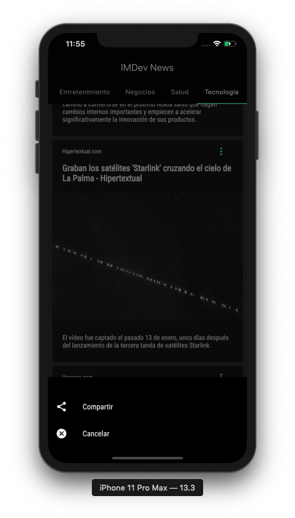

# Mexico_News

A project to show top 20 news of Mexico in different categories. 
This project is realized with Flutter :blue_heart: :+1:

## Getting Started :rocket:

This project uses the api NewsAPI.org. The main source is Mexico.
Contains 7  different categories, like: Bussines, Health, Technology, etc.  

- [Api NewsApi.org](https://newsapi.org)

You can use this repo for work with him and learn more about Flutter. 

 

## Find her in the Play Store as a MX Noticias.

